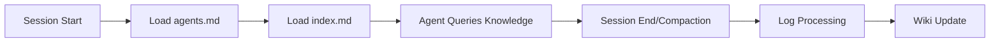
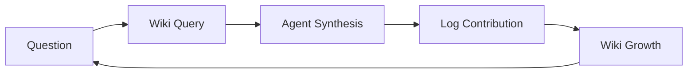

Here is the corrected and properly formatted summary, with the `.mmd` references changed to `.md` and optimized with collapsible sections to make it easier to navigate.

# Self-Evolving Claude Code Memory System Summary  
*Based on Cole Medin's implementation inspired by Karpathy's LLM Knowledge Bases*  
**GitHub Repo**: [coleam00/claude-memory-compiler](https://github.com/coleam00/claude-memory-compiler)  

---

<details open>
<summary><h3>⏰ Introduction & Karpathy's Inspiration [0:00-2:31]</h3></summary>

- **Problem**: Rapid evolution of AI tools requires efficient knowledge capture.
- **Karpathy's Framework**:  
  - Personal knowledge bases for research topics (external data → Obsidian vault).
  - Workflow: Data ingestion → Viewing → Querying → Formatting → Health checks.
- **Cole's Innovation**: Adapts framework for **internal data** (conversations with coding agents).
  - Goal: Create an evolving memory for Claude Code tied to codebases.

</details>

<details open>
<summary><h3>⚙️ Compiler Analogy & How it Works [2:32-6:00]</h3></summary>

1. **Source (Raw Folder)**: Unprocessed data (articles/papers in Karpathy's system → session logs in Cole's).
2. **Compiler (LLM Processing)**: Cleans/organizes data, creates summaries & links.
3. **Executable (Wiki)**:  
   - Structured knowledge base (Markdown files).
   - Backlinks for graph traversal (Obsidian Graph View).
4. **Test Suite**: Linting for gaps, stale data, and broken links.
5. **Runtime**: Query execution via index files (no vector database or semantic search needed).

</details>

<details>
<summary><h3>🔁 Data Flow & Architecture [6:01-8:41]</h3></summary>



- **Key Files**:  
  - `agents.md`: Global rules/meta-reasoning about the system.
  - `index.md`: Actively maintained file index for agent navigation.
- **Minimal Setup**: Entire system bootstrapped via a single prompt to Claude.

</details>

<details>
<summary><h3>💾 Claude Code Memory Implementation [8:42-10:42]</h3></summary>

| Component         | Karpathy's Version | Cole's Version      |
|-------------------|---------------------|---------------------|
| **Data Source**   | Web articles/papers | Claude session logs |
| **Storage**       | Obsidian vault      | Project-specific KB |
| **Processing**    | Manual scripts      | Automated hooks     |
| **Use Case**      | External research   | Codebase evolution  |

**Features**:  
- Automatic log capture with Claude hooks.
- Structured knowledge extraction via Claude Agent SDK.
- Per-codebase memory retention.

</details>

<details>
<summary><h3>⚡ System Setup & Obsidian Integration [10:43-12:16]</h3></summary>

1. **Initialize System**:
   ```python
   # Send bootstrap prompt to Claude:
   "Implement knowledge base system per Karpathy's PRD"
   ```
2. **Obsidian Configuration**:  
   - Open codebase folder as an Obsidian vault.
   - Themes/Customization (e.g., Obsidianite + dark mode).
3. **Folder Structure**:  
   - `daily_logs/`: Raw session summaries (equivalent to `raw` folder).
   - `knowledge/`: Compiled wiki (`index.md`, `concepts/`, connections).

</details>

<details open>
<summary><h3>🪝 Claude Hooks Workflow [12:17-16:50]</h3></summary>

```json
{
  "hooks": {
    "session_start": "load_agent_and_index.py",
    "pre_compact": "capture_logs.py",
    "session_end": "capture_logs.py"
  }
}
```

| Hook | Trigger | Action |
|------|---------|--------|
| `session_start` | New session | Loads `agents.md` + `index.md` |  
| `pre_compact` / `session_end` | Context loss | Summarizes messages → daily logs |  

**Autonomous Processing**:  
- Background Claude processes handle summarization and compilation.
- Daily `flush` process converts logs → wiki knowledge.
- **Query Example**:  
  > *"What should I watch out for in this codebase?"* → Agent queries KB → Answers in seconds using the index, bypassing slow full-codebase scans.

</details>

<details>
<summary><h3>⚛️ Compounding Knowledge Loop [16:51-18:34]</h3></summary>


- **Benefits**:  
  - Eliminates manual knowledge maintenance.
  - Answers improve organically over time: $Knowledge_{t+1} = Knowledge_t + \Delta \text{Logs}$
  - Customizable prompts via `scripts/compile.py`.
- **Sample Log Output**:  
  ```markdown
  ## 2024-04-22.md
  - Explored best practices for external service data  
  - Lessons: Always validate third-party API schemas  
  - Action: Implement middleware validation layer  
  ```

</details>

<details>
<summary><h3>🎯 Conclusion [18:35-End]</h3></summary>

- **Core Innovation**: Internal-data LLM knowledge base for self-evolving coding agents. 
- **Key Advantage**: No complex Retrieval-Augmented Generation (RAG) or vector DBs—just simple Markdown-based traversal.
- **Resources**:  
  - [Dynamis Community](https://discord.gg/dynamis) for advanced second-brain builds.
  - Full implementation: [GitHub Repo](https://github.com/coleam00/claude-memory-compiler).

> *"Our agent is going to be able to search through our knowledge better over time. As we ask more questions, it gets better and better and better – and we don’t have to maintain anything."* – Cole Medin

</details>